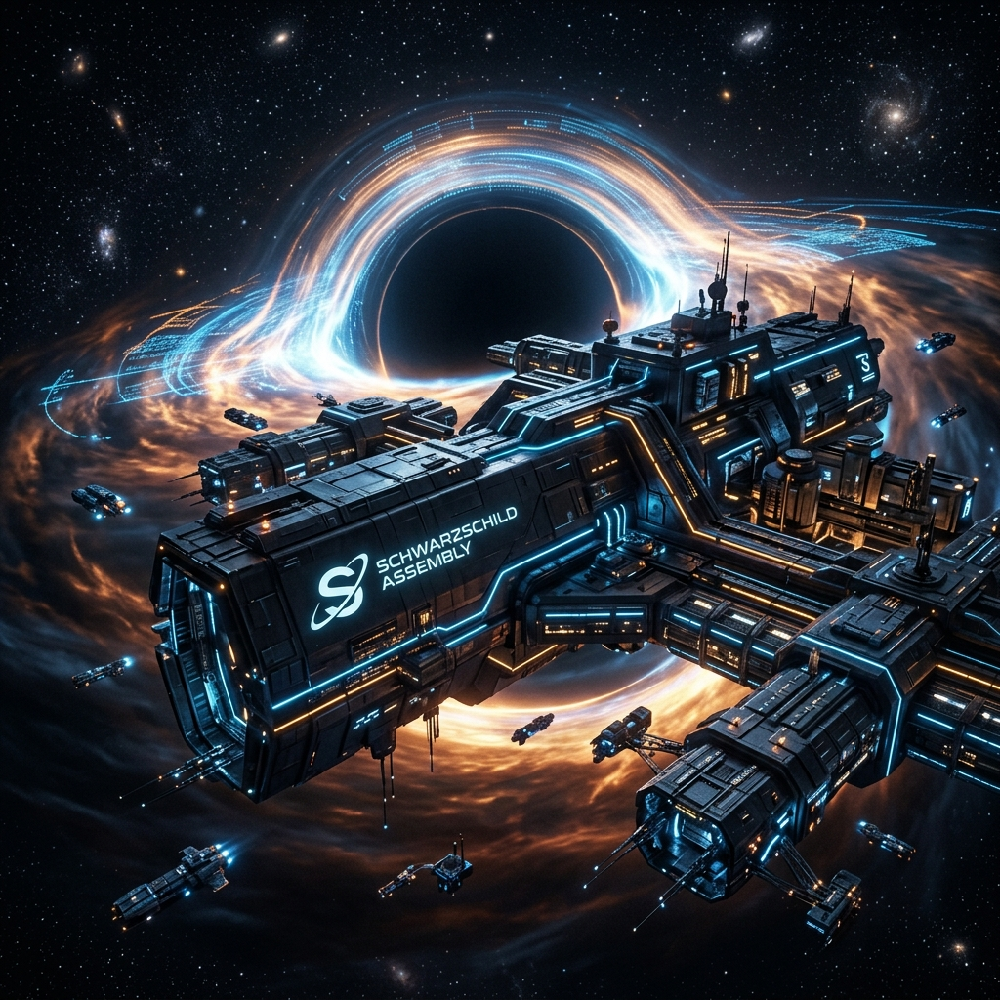

# 🔘 Schwarzschild Assembly



```text
// LOG_LEVEL: 4 (CRITICAL)
// SYSTEM_ID: SATI-CENTRAL-ALPHA
// PROTOCOL: SCHWARZSCHILD-RADIUS-ENFORCEMENT
// STATUS: PHASE_4_COMPLETE
```

[](LICENSE)
**[📍 Navigation Map](../CONTENTS.md)**

---

## 🌌 Project Overview

**Schwarzschild Assembly** is the high-integrity orchestration substrate for the **Sati-Central** multi-factory agentic ecosystem. It defines a deterministic "Event Horizon" for autonomous AI actions.

In the vacuum of unconstrained agency, the **Verification Gap** allows for catastrophic state corruption. This assembly ensures that no proposal crosses the event horizon without a mathematically proven safety certificate.

### 📜 The Prime Directives (Standing Orders)
1. **Verified Evolution**: You cannot safely evolve what you cannot formally verify.
2. **Measured Evolution**: You cannot effectively evolve what you cannot measure.
3. **Observed Evolution**: You cannot measure what you cannot observe.

---

## ⚡ Hardware & Tactical Runtime

Built specifically for the **Silicon-Class M5 Substrate**, utilizing every cycle of the ARM64 Darwin kernel.

- **Processor**: Apple M5 Pro / M5 Max.
- **Neural Interconnect**: Native **Neural Accelerator** integration in every GPU core for ultra-low latency inference.
- **Memory Substrate**: 307–600+ GB/s unified memory bandwidth, ensuring zero-bottleneck data flow between the Go Root Spine and the Rust Safety Rail.
- **Containerization**: **Wasmtime** Layer 3/4 isolation, providing a "cold-vacuum" execution environment for verified artifacts.

---

## 🏗️ The 6-Phase Strategic Roadmap

| Phase | Designation | Status | Objective |
|:---:|:---|:---:|:---|
| **01** | **Observability Substrate** | **COMPLETE** | High-density OTel instrumentation & Merkle-log audit trail. |
| **02** | **Safety Rail Tier 1** | **COMPLETE** | Z3 SMT constraint verification & Wasmtime sandboxing. |
| **03** | **Root Spine Skeleton** | **COMPLETE** | Go-based gRPC control plane & MCP Host integration. |
| **04** | **Translucent Gate UI** | **COMPLETE** | Tactical human-in-the-loop decision portal. |
| **05** | **Synthetic Analyst Factory** | *PENDING* | Reference implementation for cross-domain agent factories. |
| **06** | **Dhamma-Adviser** | *PENDING* | Bilara-grounded ethical scoring & evidence production. |

---

## 🛠️ Technology Manifest

- **Core Logic**: `Go` (Root Spine, kqueue event loop).
- **Formal Methods**: `Rust` (Safety Rail, Z3 SMT).
- **Audit Integrity**: `Merkle Tree` (RFC 6962 compliant).
- **Telemetry**: `OpenTelemetry` (Typed JSON schemas).
- **Architecture**: `Self-Optimizing` (ActionProposal → SafetyVerdict → DeltaEval).

---

## 📜 Legal & Liability

This industrial-grade substrate is licensed under the **Apache License 2.0**. 
- **Liability Disclaimer**: Explicitly disclaims all warranties and limits liability for use in high-agency environments.
- **Permissions**: Grants perpetual, worldwide rights to modify and distribute the assembly.

See [LICENSE](LICENSE) for the full governing text.

---

*Part of the [AntiGravity](https://chromewebstore.google.com/detail/antigravity-browser-exten/eeijfnjmjelapieobjiielcpmhhchbkg) station infrastructure.*
